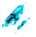
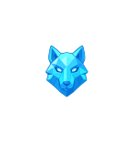
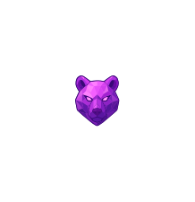
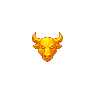
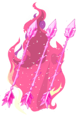
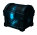
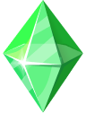

<div align="center">

#  LEGEND OF THE VOIDBREAKERS

## _Three Guardians. One broken crown. Valdris stands on the edge of the Void_

[](https://voidbreakers.vercel.app)
[](./LICENSE)


_Three guardians. One kingdom. Shattered destiny. Match your way to victory._

[📋 Join Waitlist](https://voidbreakers-waitlist.vercel.app/) • [🎮 Play Demo](https://voidbreakers.vercel.app/) • [🎬 Watch Demo](https://www.youtube.com/channel/UCVhjhENMlYSd2ABeNDw5-cQ)

</div>

---

##  Table of Contents

- [Overview](#-overview)
- [Game Concept & Mechanics](#-game-concept--mechanics)
- [Player Interaction](#-player-interaction--progression)
- [On-Chain Integration](#-on-chain-integration)
- [Power-Ups & Mechanics](#%EF%B8%8F-power-ups--future-mechanics)
- [Leaderboards & Community](#-leaderboards--community)
- [Monetization](#-monetization)
- [Technical Specifications](#-technical-specifications)
- [Installation](#-installation--run-locally)
- [License](#-license--credits)

---

##  Overview

**Legend of the Voidbreakers** is a strategy-driven puzzle adventure game where players break through collapsing realms of the Void using skill, timing, and tactical power-ups.

Voidbreakers blends classic match mechanics with onchain systems that enhance competition, ownership, and community without interrupting gameplay.

Players take control of their own Legend of the Void (LOV) character, progress through handcrafted levels across multiple realms, and compete on leaderboards while shaping the world and community around the game.

Voidbreakers is designed to scale from web to mobile, with blockchain components built on Starknet using Cairo and Dojo for verifiable progression, competitive systems, and future multiplayer expansion.

### Core Loop

```
Match Gems → Create Power-Ups → Clear Board → Unlock Realms → Own Assets → Compete Globally
```

**Genre:** Puzzle • Strategy • RPG  
**Platform:** Web (Present) • Mobile (Coming Soon)  
**Status:** Alpha Demo Live

---

##  Game Concept & Mechanics

### The Game Lore

The kingdom of **Valdris** has fallen into chaos. The Celestial Crown has been shattered by **Malakor the Shadow Weaver**, opening rifts that consume reality itself. Three heroes from different realms must collect the **Prismatic Gems** and **Warden Amulets** to restore balance.

- **Caden of Valdris** (Wolf Spirit) 
- **Aria of the IronPeak** (Bear Spirit) 
- **Draven the Storm Breaker** (Bull Spirit) 

### Core Mechanics

#### 1. Gem Matching System

| Match Type          | Effect                           | Creates                  |
| ------------------- | -------------------------------- | ------------------------ |
| **3 Gems**          | Clear matched gems, score points | -                        |
| **4 Gems (Row)**    | Clear gems + create special      | Horizontal Sword         |
| **4 Gems (Column)** | Clear gems + create special      | Vertical Sword           |
| **5+ Gems**         | Massive clear + special          | Super Power-Up (Planned) |

#### 2. Special Gems: Swords

**Horizontal Sword** (Created from 4-match in a row)

- **Activation:** Match 3 with the sword
- **Effect:** Clears entire ROW
- **Visual:** Sword icon pointing horizontally

**Vertical Sword** (Created from 4-match in a column)

- **Activation:** Match 3 with the sword
- **Effect:** Clears entire COLUMN
- **Visual:** Sword icon pointing vertically

**Cross Blast** (Sword + Sword combo)

- **Activation:** Swap two swords together
- **Effect:** Clears both row AND column (mega combo!)
- **Visual:** Explosive cross-shaped blast

#### 3. Match Resolution Flow

```mermaid
[See Diagram 1 Below]
```

#### 4. Board Mechanics

**Gravity System:**

- Gems fall downward to fill empty spaces
- New gems spawn from top
- Cascading matches trigger automatically
- Special gems (swords) maintain their properties when falling

**Cascade Logic:**

- After a match, gems fall
- If new matches form → trigger automatically
- Continue until no more matches
- Score multiplier increases with each cascade

---

##  Player Interaction & Progression

### Controls

**Desktop:**

- Click & drag gems to swap with adjacent tiles
- Valid swaps: horizontal or vertical (one tile distance)
- Optimized for one-handed play

**Mobile:**

- Touch & drag gems to swap (coming soon)

### Game Flow

```mermaid
[See Diagram 2 Below]
```

### Progression System

#### Realms (Levels)

**1. Frostpine Wilds** (Levels 1-20)

- Environment: Ice caves, frozen platforms
- Difficulty: Easy
- Boss: Frost Titan
- Unlocks: Caden character

**2. Ironpeak Mountains** (Levels 21-40)

- Environment: Rocky cliffs, lava flows
- Difficulty: Medium
- Boss: Mountain Lord
- Unlocks: Aria character

**3. Stormplains** (Levels 41-60)

- Environment: Lightning storms, plains
- Difficulty: Hard
- Boss: Storm Warden
- Unlocks: Draven character

**4. The Void** (Levels 61+)

- Environment: Reality-breaking chaos
- Difficulty: Expert
- Final Boss: Malakor the Voidbound
- Unlocks: Elite tier rewards

### Objectives

- **Score Target:** Reach X points within move limit
- **Gem Collection:** Collect specific gem colors
- **Survival:** Complete board without running out of moves or time
- **Boss Battles:** Special mechanics per boss fight

---

####  $LOV Token Economy

**Earning:**

- 50-100 $LOV per level completion
- Bonus for high scores
- Daily challenge rewards
- Tournament prizes

**Spending:**

- Power-up purchases (500-2000 $LOV)
- Character unlocks (5000 $LOV)
- Cosmetic skins
- Tournament entry fees

## 🏆 Leaderboards & Community (Coming soon)

### Competitive Systems

#### Global Leaderboards

**Weekly Rankings:**

- Top 100 players by highest score
- Resets every Monday
- Prize pool distributed on-chain

**All-Time Rankings:**

- Lifetime high scores
- Hall of fame status
- Special badges & titles

#### Tournament System

**Entry Types:**

- **Free Tournaments:** Open to all, smaller prizes
- **Premium Tournaments:** Entry fee required, larger pools
- **Invitation-Only:** Elite tier competitions

### Social Features

#### Guilds/Clans

- Create or join guilds (max 50 members)
- Guild leaderboards
- Shared rewards pool
- Guild tournaments
- Chat & strategy sharing

#### Referral System

- Share referral link
- Unlock bonus rewards at milestones
- Referral leaderboard

### Player Progression Flow

```mermaid
[See Diagram 4 Below]
```

##   Monetization

### Revenue Streams

#### 1. Character NFT Sales

#### 2. $LOV Token Economy

#### 3. Battle Pass (Seasonal)

#### 4. Tournament Entry Fees

#### 5. Power-Up NFTs

---

##   Technical Specifications

- Voidbreakers is developed with a progressive architecture, starting as a performant web-based prototype and evolving into a full cross-platform game with onchain systems.

**Platform:** Web-based prototype (React) with planned migration to **Unity (2.5D)**  
**Blockchain Stack:** Planned **Cairo** with **Dojo** for onchain game systems such as leaderboards, achievements, and competitive state
**Graphics:** Clean, readable 2D visuals with a strong art direction, optimized for performance and future mobile deployment
**Sound:** Light, immersive background music with clear, satisfying sound effects for matches, power-ups, and special abilities

---

##   Installation & Run Locally

### Prerequisites

- Node.js 18+ and npm
- Git
- Modern browser (Chrome/Firefox recommended)

### Quick Start

```bash
# Clone repository
git clone https://github.com/yourusername/voidbreakers.git
cd voidbreakers-game

# Install dependencies
npm install

# Run development server
npm run dev

# Open browser to http://localhost:5173
```

### Community

- **Twitter:** https://twitter.com/voidbreakers
- **TikTok:** https://www.tiktok.com/@legendofthevoidbreaker
- **Instagram:** https://www.instagram.com/legend_of_the_voidbreakers/

---

## 📜 License & Credits

### License

**Game Logic & Assets:** Proprietary - All Rights Reserved  
**MIT License:** (see [LICENSE.md](./LICENSE))

Copyright © 2025 Voidbreakers Team
